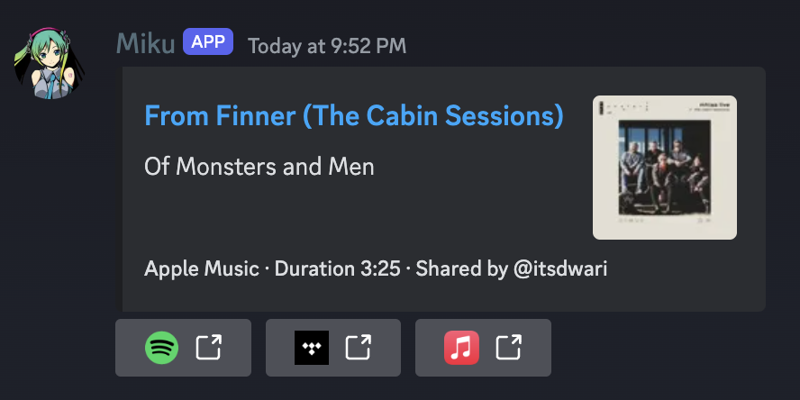

<div align="center">
    

  <p><em>A Discord bot to convert media links (e.g., Spotify, Apple Music) between each other.</em></p>

  <a href="https://github.com/jaredallard/miku/releases">
    
  </a>
  <a href="https://github.com/jaredallard/miku/blob/main/LICENSE">
    
  </a>
  <a href="https://github.com/jaredallard/miku/actions/workflows/tests.yaml">
    
  </a>
  <hr />
</div>

## Usage

While each provider has its own authentication requirements, the bot
will at minimum require a Discord bot. To create one, follow the steps
below:

1. Create a new Discord bot with the following scopes:

- `bot`
- `Send Messages`
- `Read Messages`
- Enable the `Message Content` toggle under `Privileged Gateway Intents`

2. Invite the bot to your server using the following URL (change the
   client ID to your bot's client ID).
   ```
   https://discord.com/api/oauth2/authorize?client_id=<client_id>&permissions=3072&scope=bot
   ```
3. Generate a Bot Token and take note of it.

Set the following environment variables:

```bash
MIKU_DISCORD_TOKEN="<Discord Bot Token From Step 3>"
# Optional: Limit to single channel.
MIKU_DISCORD_CHANNEL_ID="<Discord Channel ID>"
```

## Enabling Providers

Below is specific instructions/requirements for a provider to be
enabled.

### Spotify

1. Create a new Spotify app following the instructions
   [here](https://developer.spotify.com/documentation/general/guides/app-settings/#register-your-app).
2. Take note of the Client ID and Client Secret.

Set the following environment variables:

```bash
MIKU_SPOTIFY_CLIENT_ID="<Client ID>"
MIKU_SPOTIFY_CLIENT_SECRET="<Client Secret>"
```

### Apple Music

**Note**: Currently the API token will expire every 6 months and need
to be regenerated. This will eventually be automated.

1. Create a bew media identifier following the instructions
   [here](https://developer.apple.com/help/account/configure-app-capabilities/create-a-media-identifier-and-private-key/).
2. Ensure you downloaded a `.p8` and have your Team ID and Key ID ready.
3. Run the following command to generate a token:
   ```bash
   go run github.com/minchao/go-apple-music/examples/token-generator@latest \
     -l 15777000 -t "<Team_ID>" -pf "$HOME/Downloads/AuthKey_<Key_ID>.p8" \
     -k "<Key_ID>"
   ```

Set the following environment variables:

```bash
MIKU_APPLE_MUSIC_API_TOKEN="<Generated Token From Step 3>"
```

### Tidal

1. Create a new Tidal app at the [App Dashboard](https://developer.tidal.com/dashboard).
2. Take note of the Client ID and Client Secret.

Set the following environment variables:

```bash
MIKU_TIDAL_CLIENT_ID="<Client ID>"
MIKU_TIDAL_CLIENT_SECRET="<Client Secret>"
```

## Development

Setup a `.env.development` using the provider documentation above.
Reference `.env.example` to see all available options.

Export env vars from `.env.development`:

```bash
set -o allexport && source .env.development && set +o allexport
```

### Adding a New Provider

Adding a new provider is fairly straight forward. The provider interface
is only concerned with two things:

- Finding a song by URL
- Searching for a song

The interface is defined in the [`internal/streamingproviders`](https://github.com/jaredallard/miku/blob/aedf76bdb5c51e62b21f1420a8657e3216e4b753/internal/streamingproviders/streamingproviders.go#L86-L97) package.

The implementation of each function should be pretty straight forward,
but there are some things that can be good to know:

- Searching for a song _should_ be done using the song's ISRC. This is
  the most accurate (and easiest) way to find a song. However, some
  providers may not support searching by it, or it may be empty on the
  song. In this case, you can use the song's name and artist to search
  for it. This is less accurate, but should work in most cases.
- When implementing the `Info` function, try to set all fields. This
  will result in the best experience using the provider, but also the
  most performant.
- Errors returned by all functions do NOT terminate the program, instead
  they disqualify the provider. So, keep that in mind. Returning errors
  is essentially a good thing to do, while not returning them could
  cause a bad user-experience if bad data is returned.
- The `New` function of a provider should fail if there is not enough
  information to successfully instantiate the provider. For example,
  check auth configuration here. If it's invalid, fail. This will log a
  warning to the user but otherwise not terminate the program.

Once you've implemented the provider, you can enable it by default by
adding it to the `New` function in `internal/handler/handler.go`. The
default providers are instantiated there to prevent an import cycle.

## License

GPL-3.0
